# Benchmark It Yourself (BIY): Preparing a Dataset and Benchmarking AI Models for Scatterplot-Related Tasks

Supplementary materials for the [BIY paper](https://research.feedzai.com/publication/benchmark-it-yourself-biy-preparing-a-dataset-and-benchmarking-ai-models-for-scatterplot-related-tasks/).

## Dataset

### Preview

| id                                               | image                                                                                                                                                                                       | dataset_gen          | dataset_id                     | chart_design    | scale_factor | cluster_count | cluster_bboxes                                                                                                                                                                                                                            | cluster_points                                                                                                              | outlier_count | outlier_points |
| ------------------------------------------------ | ------------------------------------------------------------------------------------------------------------------------------------------------------------------------------------------- | -------------------- | ------------------------------ | --------------- | ------------ | ------------- | ----------------------------------------------------------------------------------------------------------------------------------------------------------------------------------------------------------------------------------------- | --------------------------------------------------------------------------------------------------------------------------- | ------------- | -------------- |
| gaussian_blobs_noise+500_3_0_4+x2_point_size+2   |    | gaussian_blobs_noise | gaussian_blobs_noise+500_3_0_4 | x2_point_size   | 2            | 3             | [[304.85549384307694, 39.35232736000002, 491.0333527846154, 240.52497751000004], [415.14763932, 373.73548682000006, 602.1929670000001, 592.0793562], [76.61329233230768, 157.83756931000002, 267.7722297138462, 381.59395408]]            | [[398.93870951065867, 126.76367201101812], [498.0360430663474, 476.9443330239521], [172.5215718187952, 267.4773786485542]]  | 0             | []             |
| gaussian_blobs_noise+500_3_0_4+3_4+2             | 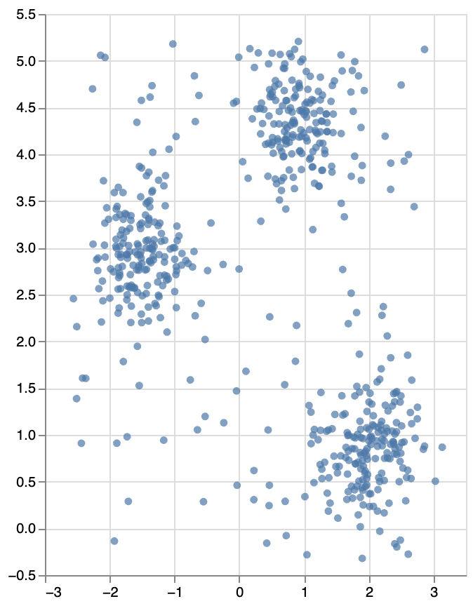             | gaussian_blobs_noise | gaussian_blobs_noise+500_3_0_4 | 3_4             | 2            | 3             | [[332.85549384307694, 59.13643648000003, 519.0333527846153, 327.36663668000006], [443.14763932, 504.9806490933334, 630.1929670000001, 796.1058082666667], [104.61329233230768, 217.11675908000004, 295.7722297138462, 515.4586054399999]] | [[426.93870951065867, 175.68489601469082], [526.0360430663475, 642.5924440319361], [200.5215718187952, 363.30317153140555]] | 0             | []             |
| gaussian_blobs_noise+500_3_0_4+points_only+2     | 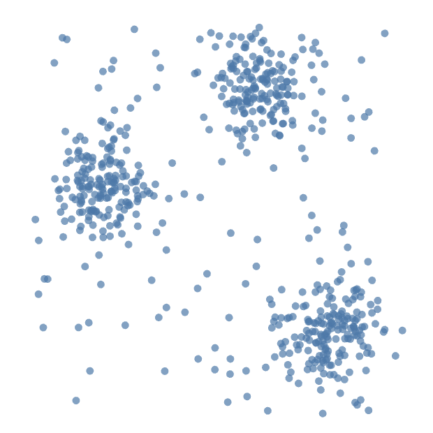     | gaussian_blobs_noise | gaussian_blobs_noise+500_3_0_4 | points_only     | 2            | 3             | [[278.85549384307694, 39.35232736000002, 465.0333527846154, 240.52497751000004], [389.14763932, 373.73548682000006, 576.1929670000001, 592.0793562], [50.61329233230769, 157.83756931000002, 241.77222971384614, 381.59395408]]           | [[372.93870951065867, 126.76367201101812], [472.0360430663474, 476.9443330239521], [146.5215718187952, 267.4773786485542]]  | 0             | []             |
| gaussian_blobs_noise+500_3_0_4+half_opacity+2    |     | gaussian_blobs_noise | gaussian_blobs_noise+500_3_0_4 | half_opacity    | 2            | 3             | [[304.85549384307694, 39.35232736000002, 491.0333527846154, 240.52497751000004], [415.14763932, 373.73548682000006, 602.1929670000001, 592.0793562], [76.61329233230768, 157.83756931000002, 267.7722297138462, 381.59395408]]            | [[398.93870951065867, 126.76367201101812], [498.0360430663474, 476.9443330239521], [172.5215718187952, 267.4773786485542]]  | 0             | []             |
| gaussian_blobs_noise+500_3_0_4+yaxis_only+2      | 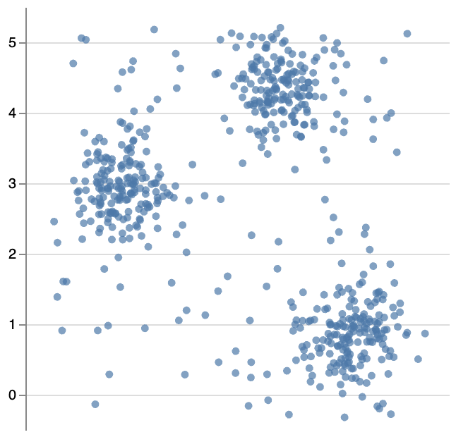      | gaussian_blobs_noise | gaussian_blobs_noise+500_3_0_4 | yaxis_only      | 2            | 3             | [[304.85549384307694, 39.35232736000002, 491.0333527846154, 240.52497751000004], [415.14763932, 373.73548682000006, 602.1929670000001, 592.0793562], [76.61329233230768, 157.83756931000002, 267.7722297138462, 381.59395408]]            | [[398.93870951065867, 126.76367201101812], [498.0360430663474, 476.9443330239521], [172.5215718187952, 267.4773786485542]]  | 0             | []             |
| gaussian_blobs_noise+500_3_0_4+dark+2            | 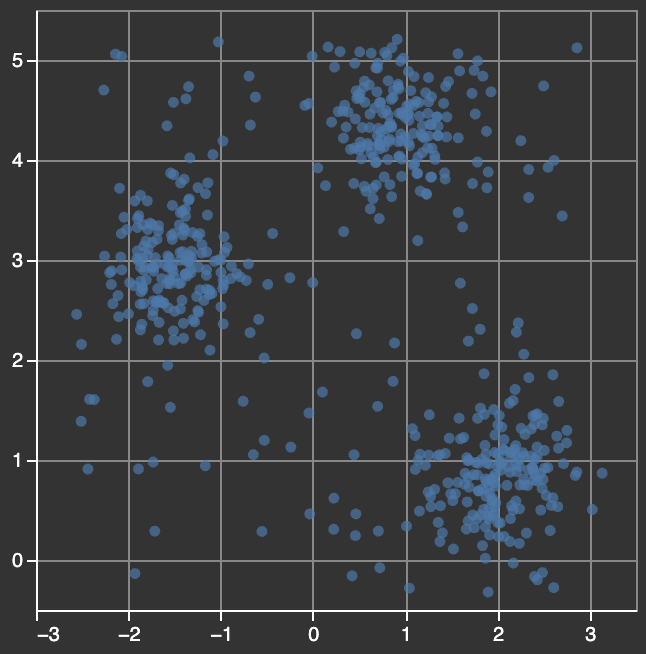            | gaussian_blobs_noise | gaussian_blobs_noise+500_3_0_4 | dark            | 2            | 3             | [[304.85549384307694, 39.35232736000002, 491.0333527846154, 240.52497751000004], [415.14763932, 373.73548682000006, 602.1929670000001, 592.0793562], [76.61329233230768, 157.83756931000002, 267.7722297138462, 381.59395408]]            | [[398.93870951065867, 126.76367201101812], [498.0360430663474, 476.9443330239521], [172.5215718187952, 267.4773786485542]]  | 0             | []             |
| gaussian_blobs_noise+500_3_0_4+square+2          |           | gaussian_blobs_noise | gaussian_blobs_noise+500_3_0_4 | square          | 2            | 3             | [[304.85549384307694, 39.35232736000002, 491.0333527846154, 240.52497751000004], [415.14763932, 373.73548682000006, 602.1929670000001, 592.0793562], [76.61329233230768, 157.83756931000002, 267.7722297138462, 381.59395408]]            | [[398.93870951065867, 126.76367201101812], [498.0360430663474, 476.9443330239521], [172.5215718187952, 267.4773786485542]]  | 0             | []             |
| gaussian_blobs_noise+500_3_0_4+16_9+2            | 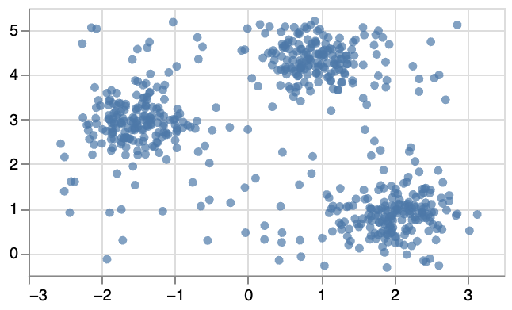            | gaussian_blobs_noise | gaussian_blobs_noise+500_3_0_4 | 16_9            | 2            | 3             | [[304.85549384307694, 26.51068414000001, 491.0333527846154, 139.67029984937503], [415.14763932, 214.60121133625003, 602.1929670000001, 337.4196378625], [76.61329233230768, 93.15863273687502, 267.7722297138462, 219.02159917]]          | [[398.93870951065867, 75.67956550619769], [498.0360430663474, 272.65618732597306], [172.5215718187952, 154.83102548981174]] | 0             | []             |
| gaussian_blobs_noise+500_3_0_4+9_16+2            | 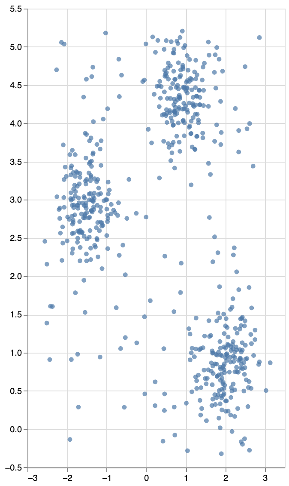            | gaussian_blobs_noise | gaussian_blobs_noise+500_3_0_4 | 9_16            | 2            | 3             | [[332.85549384307694, 72.1819153066667, 519.0333527846153, 429.8221822400001], [443.14763932, 666.6408654577779, 630.1929670000001, 1054.8077443555555], [104.61329233230768, 282.82234544000005, 295.7722297138462, 680.6114739200001]]  | [[426.93870951065867, 227.5798613529211], [526.0360430663475, 850.1232587092483], [200.5215718187952, 477.7375620418741]]   | 0             | []             |
| gaussian_blobs_noise+500_3_0_4+random_shapes+2   | 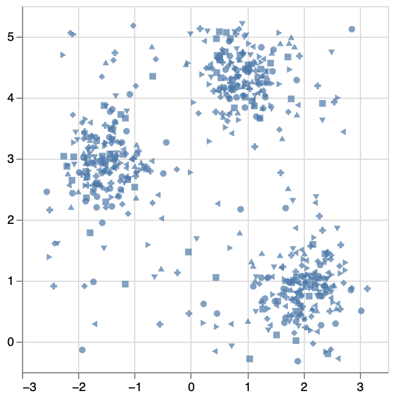   | gaussian_blobs_noise | gaussian_blobs_noise+500_3_0_4 | random_shapes   | 2            | 3             | [[304.85549384307694, 39.35232736000002, 491.0333527846154, 240.52497751000004], [415.14763932, 373.73548682000006, 602.1929670000001, 592.0793562], [76.61329233230768, 157.83756931000002, 267.7722297138462, 381.59395408]]            | [[398.93870951065867, 126.76367201101812], [498.0360430663474, 476.9443330239521], [172.5215718187952, 267.4773786485542]]  | 0             | []             |
| gaussian_blobs_noise+500_3_0_4+full_opacity+2    |     | gaussian_blobs_noise | gaussian_blobs_noise+500_3_0_4 | full_opacity    | 2            | 3             | [[304.85549384307694, 39.35232736000002, 491.0333527846154, 240.52497751000004], [415.14763932, 373.73548682000006, 602.1929670000001, 592.0793562], [76.61329233230768, 157.83756931000002, 267.7722297138462, 381.59395408]]            | [[398.93870951065867, 126.76367201101812], [498.0360430663474, 476.9443330239521], [172.5215718187952, 267.4773786485542]]  | 0             | []             |
| gaussian_blobs_noise+500_3_0_4+4_3+2             | 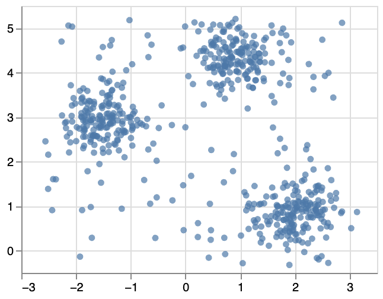             | gaussian_blobs_noise | gaussian_blobs_noise+500_3_0_4 | 4_3             | 2            | 3             | [[304.85549384307694, 32.01424552000002, 491.0333527846154, 182.89373313250002], [415.14763932, 282.80161511500006, 602.1929670000001, 446.55951715], [76.61329233230768, 120.87817698250002, 267.7722297138462, 288.69546556]]           | [[398.93870951065867, 97.57275400826359], [498.0360430663474, 360.2082497679641], [172.5215718187952, 203.10803398641562]]  | 0             | []             |
| gaussian_blobs_noise+500_3_0_4+colors+2          | 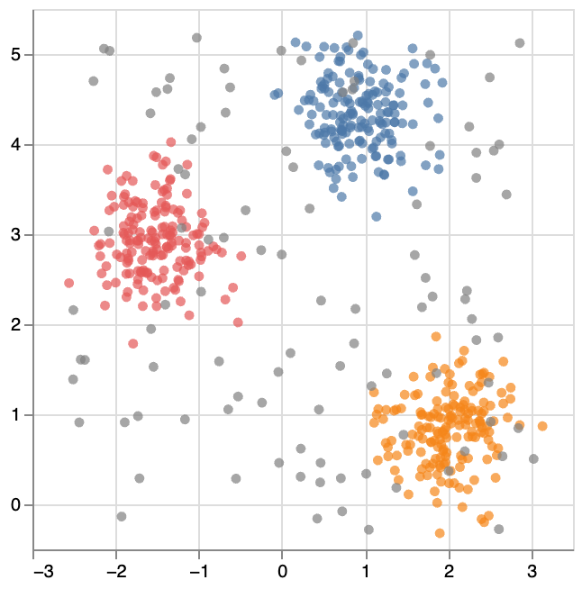          | gaussian_blobs_noise | gaussian_blobs_noise+500_3_0_4 | colors          | 2            | 3             | [[304.85549384307694, 39.35232736000002, 491.0333527846154, 240.52497751000004], [415.14763932, 373.73548682000006, 602.1929670000001, 592.0793562], [76.61329233230768, 157.83756931000002, 267.7722297138462, 381.59395408]]            | [[398.93870951065867, 126.76367201101812], [498.0360430663474, 476.9443330239521], [172.5215718187952, 267.4773786485542]]  | 0             | []             |
| gaussian_blobs_noise+500_3_0_4+default+2         |          | gaussian_blobs_noise | gaussian_blobs_noise+500_3_0_4 | default         | 2            | 3             | [[304.85549384307694, 39.35232736000002, 491.0333527846154, 240.52497751000004], [415.14763932, 373.73548682000006, 602.1929670000001, 592.0793562], [76.61329233230768, 157.83756931000002, 267.7722297138462, 381.59395408]]            | [[398.93870951065867, 126.76367201101812], [498.0360430663474, 476.9443330239521], [172.5215718187952, 267.4773786485542]]  | 0             | []             |
| gaussian_blobs_noise+500_3_0_4+half_point_size+2 | 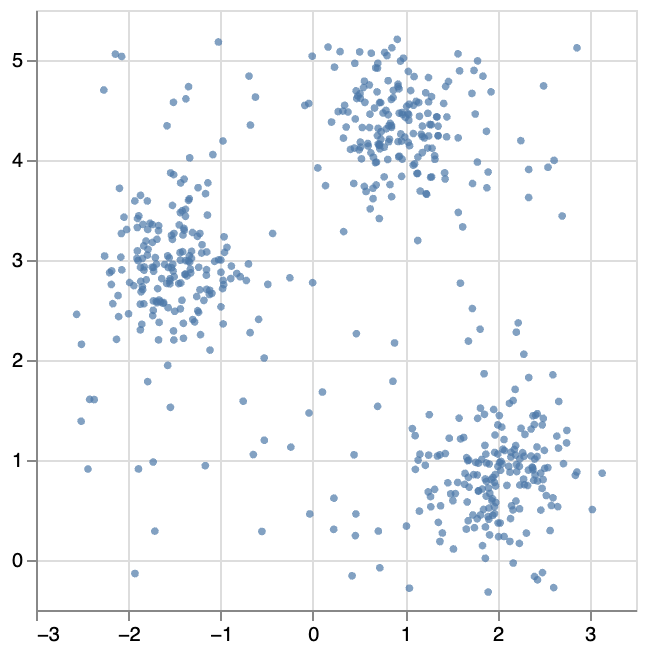 | gaussian_blobs_noise | gaussian_blobs_noise+500_3_0_4 | half_point_size | 2            | 3             | [[304.85549384307694, 39.35232736000002, 491.0333527846154, 240.52497751000004], [415.14763932, 373.73548682000006, 602.1929670000001, 592.0793562], [76.61329233230768, 157.83756931000002, 267.7722297138462, 381.59395408]]            | [[398.93870951065867, 126.76367201101812], [498.0360430663474, 476.9443330239521], [172.5215718187952, 267.4773786485542]]  | 0             | []             |
| gaussian_blobs_noise+500_3_0_4+21_9+2            | 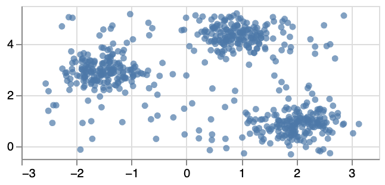            | gaussian_blobs_noise | gaussian_blobs_noise+500_3_0_4 | 21_9            | 2            | 3             | [[304.85549384307694, 22.579568868571435, 491.0333527846154, 108.79641893285716], [415.14763932, 165.88663720857147, 602.1929670000001, 259.4625812285715], [76.61329233230768, 73.3589582757143, 267.7722297138462, 169.25455174857143]] | [[398.93870951065867, 60.04157371900777], [498.0360430663474, 210.11899986740806], [172.5215718187952, 120.34744799223752]] | 0             | []             |
| gaussian_blobs_noise+500_3_0_4+random_colors+2   | 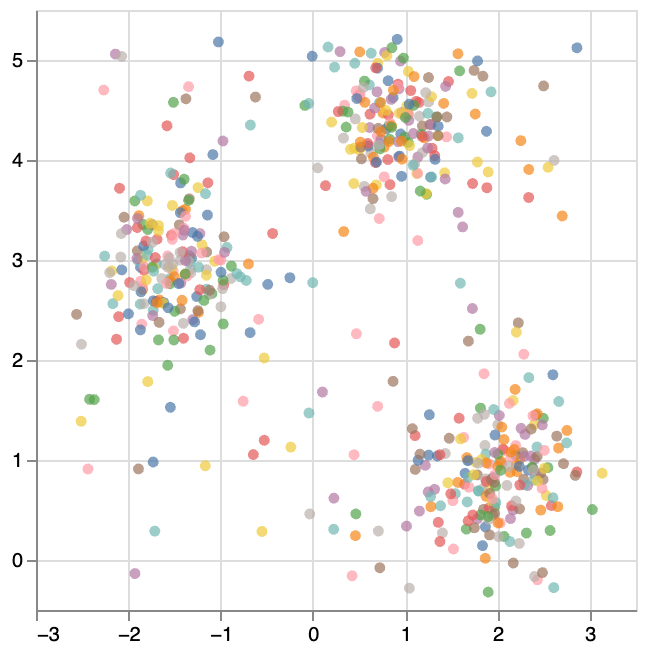   | gaussian_blobs_noise | gaussian_blobs_noise+500_3_0_4 | random_colors   | 2            | 3             | [[304.85549384307694, 39.35232736000002, 491.0333527846154, 240.52497751000004], [415.14763932, 373.73548682000006, 602.1929670000001, 592.0793562], [76.61329233230768, 157.83756931000002, 267.7722297138462, 381.59395408]]            | [[398.93870951065867, 126.76367201101812], [498.0360430663474, 476.9443330239521], [172.5215718187952, 267.4773786485542]]  | 0             | []             |

## Benchmark

### Preview

<figure>
  
  <figcaption>A promising result for the cluster detection task (left) and an unsuccessful one for the outlier identification task (right). The X-shaped points are the outliers predicted by GPT-4o.</figcaption>
</figure>
